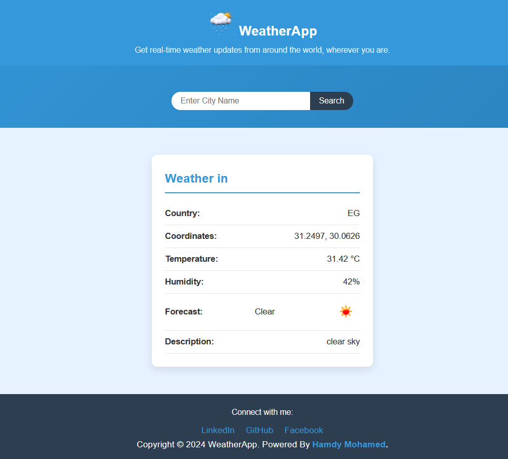

# Weather App

A Django-based weather application that allows users to search for weather data in any city. The app fetches real-time weather information using the [OpenWeatherMap API](https://openweathermap.org/).

## Features

- Search for the current weather of any city.
- Displays temperature, humidity, weather conditions, and a forecast.
- Clear and simple UI.

## Screenshot



## Requirements

- Django
- OpenWeatherMap API key

## Installation

1. Clone the repository:

   ```bash
   git clone https://github.com/Y00RG/Weather-App.git
   ```

2. Navigate to the project directory:

   ```bash
   cd Weather-App
   ```

3. Install the dependencies (use a virtual environment if needed):

   ```bash
   pip install -r requirements.txt
   ```

4. Create a `.env` file and add your OpenWeatherMap API key:

   ```
   API_KEY=your_openweathermap_api_key
   ```

5. Run the server:

   ```bash
   python manage.py runserver
   ```

6. Open your browser and navigate to:
   ```
   http://127.0.0.1:8000
   ```
